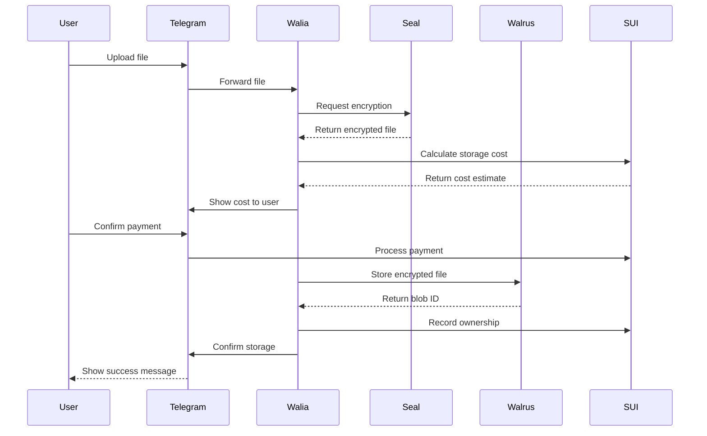
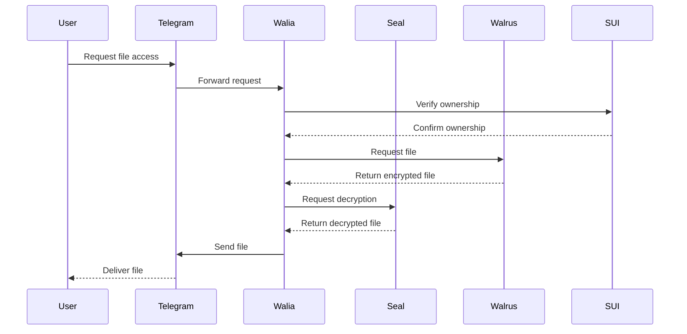
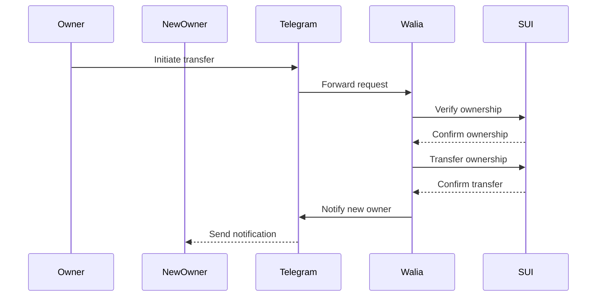
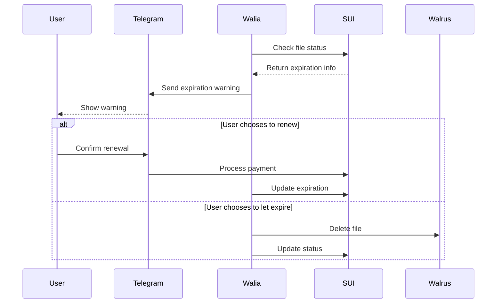

# Walia – Your File Manager Assistant on Telegram
<table>
  <tr>
    <td width="140" valign="top">
      
    </td>
    <td valign="top">
      <strong>Walia</strong> is a decentralized file manager assistant integrated with <strong>Telegram</strong>, designed to store, encrypt, and manage file ownership through the <strong>SUI blockchain</strong>. Powered by the <strong>Walrus Protocol</strong> for storage and <strong>Seal Protocol</strong> for encryption, Walia offers a secure, user-friendly interface to manage files with fine-grained control over duration, cost, and ownership.
    </td>
  </tr>
</table>

## 📑 Contents

- [Key Features](#-key-features)
- [Extended Use Cases](#-extended-use-cases)
- [Tech Stack](#️-tech-stack)
- [Get Started](#-get-started)
- [Roadmap / TODO](#️-roadmap--todo)
- [Contact the team](#-contact-us)

---

## 🚀 Key Features

- 📁 **File Storage on Blockchain**  
  Upload and store files securely using the Walrus Protocol, ensuring immutability and availability.

- 🔐 **End-to-End Encryption**  
  Apply Seal Protocol to encrypt files before storing, maintaining confidentiality and privacy.

- 🕒 **Epoch-Based Storage Duration**  
  Select the duration of storage in **epochs**, with real-time price estimation provided by the bot.

- 💸 **Cost Estimation**  
  Walia calculates the estimated price for the selected duration and guides users through the payment process.

- 📂 **File Listing with Metadata**  
  View a list of stored files, including **expiration dates**, **file size**, and **status**, directly in the Telegram chat.

- 👤 **Ownership Transfer**  
  Seamlessly transfer file ownership using Telegram nicknames or SUI wallet addresses.

- 🔥 **Burn & Refund**  
  Delete files early and receive a proportional refund based on unused storage time.

- ⏰ **Expiration Notifications & Renewal Suggestions**  
  **Walia** proactively notifies users when a file's storage is nearing expiration and offers a seamless option to extend the duration.

---

## 🔧 Extended Use Cases

### 1. 📚 **Decentralized Academic Records**  
Store and transfer academic credentials with secure access and immutable history.

### 2. 🧾 **Immutable Legal Document Vault**  
Protect and transfer legal documents like contracts and wills.

### 3. 🖼️ **NFT Attachment Storage**  
Bind files to NFTs securely without relying on IPFS.

### 4. 👥 **Secure Team File Sharing**  
Enable ephemeral and encrypted team collaboration with access revocation.

### 5. 🕵️ **Whistleblower Information Locker**  
Allow time-locked and anonymous storage of sensitive files.

### 6. 💾 **Data Leasing Marketplace**  
Support temporary file rentals with automatic revocation.

### 7. 🛡️ **Disaster-Proof Personal Backups**  
Back up essential personal files with encryption and ownership control.

---

## 🛠️ Tech Stack

- **Frontend**: Telegram Bot Interface  
- **Blockchain**: SUI for storage, epochs, and ownership tracking  
- **Protocols**:  
  - Walrus (Decentralized File Storage)  
  - Seal (End-to-End Encryption)  
- **Token**: **WaliaToken** – custom utility token for internal transactions and fee settlements  
- **Payment & Pricing**: Epoch-based dynamic calculation  
- **Notification Service**: Telegram-based alerts for expiration and renewal  

---

## 🔄 How It Works

### File Upload Flow

### File Access Flow

### File Transfer Flow

### File Expiration Flow

---

## 📌 Get Started

Stay tuned – full instructions, bot access, and deployment details coming soon!

📁 GitHub: [github.com/your-repo-link](#)  
✈️ Telegram Bot: @WaliaBot (launching soon)

---

## 🗺️ Roadmap / TODO

- [ ] **Encryption Option Selector**  
  Allow users to choose between **Seal-encrypted** or **public/plain** file storage before uploading.

- [ ] **Storage Cost Optimization with Compression**  
  Analyze files and suggest compression to reduce storage fees.

- [ ] **SUI Name Service (SuiNS) Integration**  
  Share files using human-readable names instead of wallet addresses.

- [ ] **Multi-language Bot Interface**  
  Add support for additional languages for international users.

- [ ] **Integration with SUI Wallet Connect**  
  Simplify wallet interactions from within Telegram.

- [ ] **Audit Log for File Actions**  
  Display a private activity history for each user's files.

- [ ] **Timelock Encryption Support**  
  Use [HexCapsule](https://www.hexcapsule.com/about) protocol for data to be encrypted in such a way that it can only be decrypted after a specified period has elapsed. This method ensures that the encrypted information remains inaccessible until the predetermined time has passed, regardless of who possesses the encrypted data.

- [ ] **Scheduled File Release**  
  Schedule file availability based on time or epoch.

- [ ] **Time-Limited Access Sharing**  
  Temporarily share access, with automatic expiration.

- [ ] **WaliaToken Ecosystem Integration**  
  Use **WaliaToken** to pay for services, receive rewards, and enable premium features within the platform.

## 📬 Contact Us
Have questions or want to collaborate?

Team Name: **GanAIWeb3Club**   
Email: Tiunow@gmail.com, skrypnychenkoandrii808@gmail.com, cryptospecura@gmail.com, grossbel13@gmail.com.
